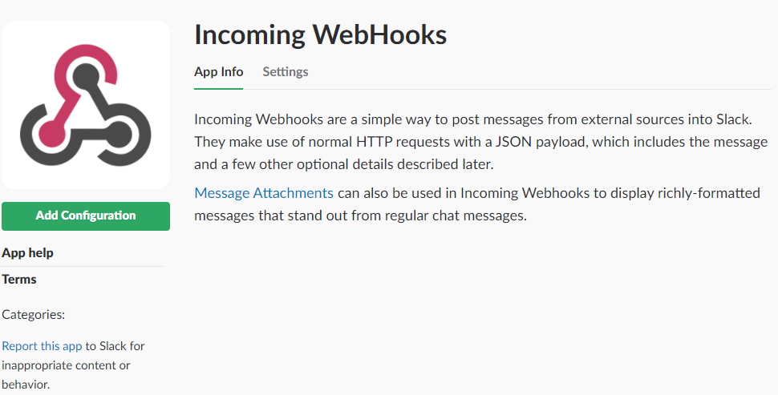

Slack DockerHub Notification On Google AppEngine
===

[](https://travis-ci.org/rayyildiz/slack-dockerhub-notify)
[](https://ci.appveyor.com/project/rayyildiz/slack-dockerhub-notify)


[](https://deploy.cloud.run)


Enable Incoming WebHook
---

You need to enable ```Incoming WebHooks``` first. You can search for [Incoming WebHooks](https://slack.com/apps/new/A0F7XDUAZ-incoming-webhooks) and add.




**Webhook URL** should be like ```https://hooks.slack.com/services/T123456789/000000000000000/777777777777777777777```


Deploy to AppEngine
---

[AppEngine](https://cloud.google.com/free/docs/always-free-usage-limits) has always free usage. You can use appengine for webhook. Create appengine on [Google Console](https://console.cloud.google.com/appengine). If you don't have any account, just [click here](https://cloud.google.com/free/) to sign up.

```bash
git clone https://github.com/rayyildiz/slack-dockerhub-notify.git
cd slack-dockerhub-notify
```

Changed the ```name``` and ```version``` on [app.yaml](app.yaml).

Run this command to deploy your project to AppEngine. ```goapp``` should be in the **path** variable. [More info](https://cloud.google.com/appengine/docs/standard/go/download)

```bash
goapp deploy app.yaml --project [PROJECT-ID]
```

URL should be like ```https://slack-notify.rayyildiz.dev/```. [More Info](https://docs.docker.com/docker-hub/webhooks/) .

WebHook URL must be ```https://slack-notify.rayyildiz.dev/services/T123456789/000000000000000/777777777777777777777``` .
Change the ```https://hooks.slack.com``` with ```https://slack-notify.rayyildiz.dev```
